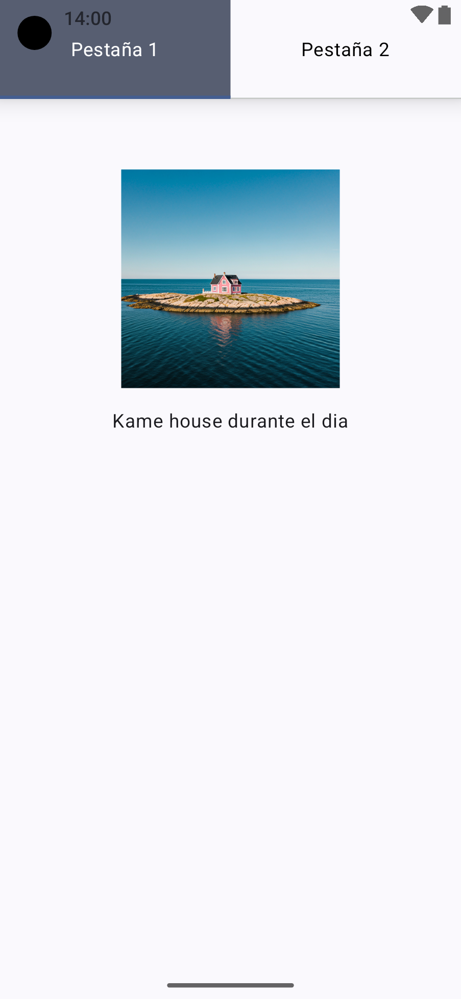
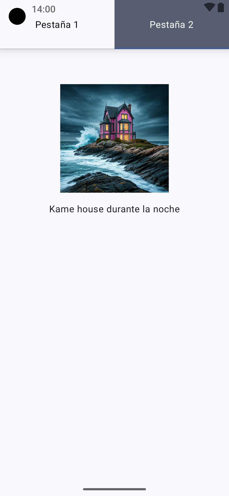

# UD2_08_Tabs

Esta aplicación demuestra cómo usar pestañas (`Tabs`) en Jetpack Compose para alternar entre diferentes pantallas dentro de una aplicación Android.

<figure>
    
    <figcaption>Vista de la aplicación</figcaption>
</figure>
<figure>
    
    <figcaption>Vista de la aplicación</figcaption>
</figure>

## Características

- Implementación de dos pestañas personalizadas.
- Diseño adaptable al tema del sistema.
- Ejemplo de navegación entre pestañas usando `TabRow` y `Scaffold`.
- Uso de Jetpack Compose y Material Design 3.

## Estructura del Proyecto

### Paquete Principal

- `MainActivity`: Contiene la función principal de la aplicación y define el `Scaffold` con las pestañas.
- `MyApp`: Composable principal que administra la interfaz y el estado de la pestaña seleccionada.

### Paquetes Secundarios

- `com.elarreglador.ud2_08_tabs.tabs`
    - `Tab1Screen`: Contenido de la primera pestaña.
    - `Tab2Screen`: Contenido de la segunda pestaña.

- `com.elarreglador.ud2_08_tabs.ui.theme`
    - Define los temas y estilos usados en la aplicación.

## Código Destacado

### Creación de las Pestañas
```
TabRow(
    selectedTabIndex = selectedTab,
    Modifier.shadow(10.dp),
) {
    Tab(
        selected = selectedTab == 0,
        onClick = { selectedTab = 0 },
        selectedContentColor = Color.White,
        unselectedContentColor = Color.Black,
        modifier = Modifier
            .background(if (selectedTab == 0) MaterialTheme.colorScheme.secondary else Color.Transparent)
            .padding(30.dp)
    ) {
        Text(text = "Pestaña 1")
    }
    Tab(
        selected = selectedTab == 1,
        onClick = { selectedTab = 1 },
        selectedContentColor = Color.White,
        unselectedContentColor = Color.Black,
        modifier = Modifier
            .background(if (selectedTab == 1) MaterialTheme.colorScheme.secondary else Color.Transparent)
            .padding(30.dp)
    ) {
        Text(text = "Pestaña 2")
    }
}
```

### Navegación entre Pestañas
```
Box(modifier = Modifier.padding(paddingValues)) {
    when (selectedTab) {
        0 -> Tab1Screen()
        1 -> Tab2Screen()
    }
}
```